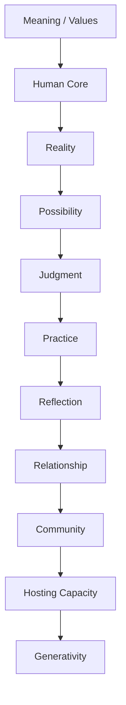

# Architecture Stress Test

## Purpose

Assume the Living Intelligence architecture is wrong. Then ask:

> "Where does it break?"

## Architecture Tested

Human Core → Reality → Possibility → Decision → Practice → Reflection → Community → Hosting Capacity → Living Civilization

AI: Mirror · Prism · Telescope · Observatory · Compass · Memory · Coordinator

---

## Failure 1 — Self-Help Machine

**Risk:** Reflection becomes optimization theater.

**Failure:** Reality → Reflection → Reflection → Reflection

**Safeguard:** Every meaningful insight must encounter reality through:

- decision
- experiment
- conversation
- deliberate non-action

---

## Failure 2 — Measurement Replaces Meaning

**Risk:** Metrics become goals.

**Failure:** Measure → Optimize Metric → Lose Purpose

**Safeguard:** Every metric must answer:

> "What human capability is this metric supposed to illuminate?"

---

## Failure 3 — AI Becomes Hidden Authority

**Risk:** AI becomes epistemic authority.

Dangerous model: Human → AI → Decision

Better model: Human → AI Dialogue → Human Judgment

Separate: Observation → Inference → Recommendation → Decision

AI supports the first three. Humans own the fourth.

---

## Failure 4 — Possibility Overload

**Risk:** AI generates endless alternatives. The Telescope never becomes the Compass.

**Safeguard:** Explore broadly → Identify patterns → Establish criteria → Narrow → Decide

---

## Failure 5 — Community Conformity

**Risk:** Trust becomes groupthink.

**Failure:** Trust → Cohesion → Consensus → Groupthink

**Safeguard:** Institutionalize productive disagreement. Ask:

> "What would make us wrong?"

And:

> "Who disagrees, and what might they be seeing that we aren't?"

---

## Failure 6 — Hosting Capacity Becomes Bureaucracy

**Risk:** Infrastructure becomes rules, committees, procedures, permissions, rigidity.

**Safeguard:** Periodically ask:

> "Is this still helping the system learn?"

Hosting must preserve: Continuity + Adaptability

---

## Failure 7 — Everyone Is Expected to Develop

**Risk:** Continuous improvement becomes an obligation.

**Safeguard:** Make room for:

- rest
- play
- contemplation
- celebration
- tradition
- ordinary life
- mystery

Not everything needs to become an experiment.

---

## Failure 8 — Elitism

**Risk:** The system benefits people with time, education, money, technology, social capital.

**Safeguard:** Ask:

> "Who cannot participate?"

Accessibility must be a design requirement.

---

## Failure 9 — Echo Chamber

**Risk:** AI reinforces what the community already believes.

**Safeguard:** Community → External Perspectives → Friction → Learning

The ecosystem needs permeability.

---

## Failure 10 — Civilizational Inflation

**Risk:** Small projects are described as civilization-scale transformation.

**Safeguard:** Maintain: Today → Week → Month → Year → Generation

A civilization-scale vision should improve tomorrow's behavior.

---

## Failure 11 — Inability to Handle Tragedy

**Risk:** The architecture overemphasizes optimization, learning, adaptation, growth.

Some things cannot be fixed.

**Safeguard:** Make room for:

- grief
- endurance
- witnessing
- carrying
- acceptance

Living Intelligence needs wisdom, not merely adaptation.

---

## Fundamental Critique — Is Intelligence Actually the Goal?

A highly capable system can pursue the wrong ends. Therefore intelligence cannot be the highest layer.

The architecture requires: **Meaning + Values**

---

## Revised Architecture

AI supports the system. It does not own the ends.

---

## Five Permanent Guardrails

1. Reality over Narrative
2. Human Agency over AI Authority
3. Meaning over Optimization
4. Dissent over Conformity
5. Adaptability over Institutional Permanence

---

## Ultimate Stress Test

Ask:

> "What happens when the system is wrong?"

A fragile system tries to prevent wrongness.

A Living Intelligence system should become better at:

- discovering wrongness
- tolerating disagreement
- learning from failure
- changing direction
- preserving identity while adapting

---

## Working Definition

> "Living Intelligence is not a system that always makes better decisions. It is a system that becomes better at discovering when its decisions, assumptions, environments, and institutions are no longer working — and has the capacity to change."

---

## Related

- [[10 - Guardrails and Failure Modes]]
- [[08 - AI Roles]]
- [[04 - Core Architecture]]
- [[09 - Operating Model]]
- [[11 - Research Map]]
