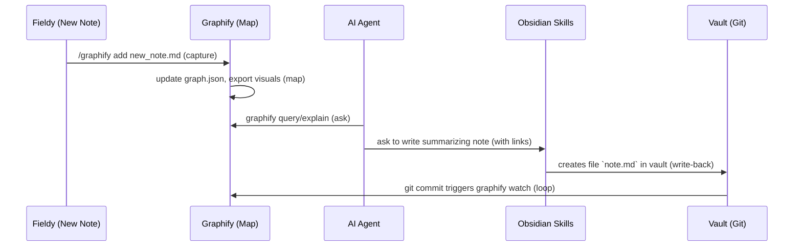
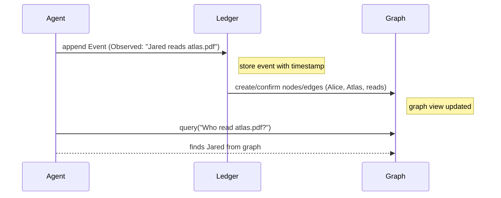

**Executive Summary:** Hyperautomation Labs’ “Living Atlas” (Graphify + Obsidian Skills) creates a *living knowledge graph*: Graphify ingests a folder of documents into a queryable graph, and an AI agent writes new notes back into the vault. This “map and hands” loop (capture→map→ask→write-back) provides a concrete instantiation of one slice of our architecture. However, our **Ledger** concept is broader: it must capture not only static documents but *events, interactions, and evolving beliefs over time*. To integrate Atlas, we propose treating the Atlas graph as a semantic layer atop a time-based ledger. Key dimensions include:

- **Architecture mapping:** Atlas (Graphify+Obsidian) can serve as the *knowledge* layer (graph/context) in our stack, complementing Fieldy (capture) and Ledger (history). The Atlas graph is essentially a semantic knowledge graph of content, whereas the Ledger is an append-only record of events and states. For example, a Graphify node “Jared – interested in – AI” is a static relationship, but the Ledger might record *when* Jared learned something, changed an assumption, or took an action.  
- **Data models/schemas:** Ledgers typically use an *event-centric* or *Data Vault*-style schema (each row is an event, with attributes and links), while knowledge graphs use a *property graph* or RDF schema (nodes and typed edges). We compare these below.  
- **Epistemic states & provenance:** The Atlas explicitly tags graph edges as **EXTRACTED**, **INFERRED**, or **AMBIGUOUS** to signal source vs inference. This suggests modeling provenance and confidence in the ledger: e.g. mark each event or fact with its origin (sensor, report, AI inference) and uncertainty.  
- **Write-back workflows:** The Atlas loop is: `/graphify add` to capture, `graphify watch` on commit to update the graph, then agent queries (`graphify query` etc), and Obsidian Skills generates new notes with wiki-links (which on commit feed back into Graphify). In our system, Fieldy captures experiences, the ledger ingests them, AI agents query the knowledge/Atlas graph plus ledger history, then agents act/write, closing the loop.  
- **Shared vs single-owner ledgers:** Hyperautomation’s Atlas is person-centric, but our **Planetary Mesh** envisions a distributed shared ledger. Work such as Neo4j Agent Memory shows multiple agents sharing one graph: “we create one set of memory tools connected to a single Neo4j instance… and pass those tools to every agent”. Shared memory prevents blind spots and enables audit trails, but raises governance: we must consider access controls and conflict resolution (e.g. using labels on events as Telicent does).  
- **Temporal/history modeling:** Ledgers naturally capture *when* and *what changed*. AIS’s “Event Graph Ledger” flips the usual model so *every* change is an immutable event, with the current state as a projection. Edges link cause→effect. This supports queries like “what was true at time T” and building provenance chains. For example, in Neo4j’s multi-agent example, a Cypher query can trace a credit decision back through entity links to the original KYC finding.  
- **Scalability/storage:** Options include graph databases (Neo4j, ArangoDB, Amazon Neptune), event stores (Kafka, EventStore, or append-only tables), and hybrids (e.g. dual-store Redis+Neo4j as in Kumiho). Graph DBs excel at rich relationships and queries (but often lack built-in immutability/time travel), whereas event stores excel at write throughput and time-based history (but are less queryable for arbitrary joins). We compare key choices below.  
- **Integration/APIs:** Graphify provides a CLI and Model-Context-Protocol (MCP) skill; Obsidian Skills offers note-writing APIs. In a full system, we might use Neo4j’s Bolt/Cypher or SPARQL for graph queries, REST/GraphQL for knowledge APIs (Telicent exposes GraphQL over stores), and gRPC/event streams for ledger writes. Agent frameworks like AWS Strands (used in the Neo4j example) or LangChain-like pipelines can coordinate the loop.  
- **Security/privacy:** Shared context needs fine-grained controls. Telicent illustrates labeling each data event with access metadata that persists through processing. Similarly, we can require cryptographic signing or hashes on ledger entries (as in AIS’s design) and enforce graph access permissions or encryption at rest. Regulatory auditability is enhanced by the graph’s explicit provenance (no “black-box” embeddings).  
- **Next steps/experiments:** We recommend prototyping a combined stack with Graphify for the knowledge graph and an event store for the ledger, then layering AI agents (e.g. using Neo4j-Agent-Memory). The final table lists candidate experiments (with tech and success criteria).

We detail each dimension below, with comparisons and diagrams.  

## Architecture Mapping (Component Correspondence)

| **Atlas (Graphify/Obsidian)**            | **Our Architecture**          | **Role / Mapping**                                       |
|-----------------------------------------|-------------------------------|----------------------------------------------------------|
| Graphify Vault (notes/doc folder)       | *Persistent Context* (Knowledge Graph) | Knowledge base of concepts, documents, code.             |
| Obsidian Vault (markdown repository)    | *Fieldy Inputs* (Capture)     | Raw inputs: observations, experiences, sensor logs.      |
| Knowledge Graph / Atlas (graph.json)    | *Knowledge/Atlas Layer*       | Semantic network of entities/concepts, updated continuously. |
| Graphify CLI + watch hook               | *Graph Update Workflow*       | Process to keep graph in sync with context (continuous mapping). |
| Obsidian Skills agent                   | *AI Agent (Sensemaking)*      | Reads graph + context, performs reasoning, writes new knowledge. |
| AI prompt for write-backs               | *Feedback Loop (Learning)*    | Agent’s outputs (new notes) feed back into persistent context. |
| Commit hook / loop (capture→map→ask→write)| *Experience→Capture→Ledger→AI→Action cycle* | Field experience captured, causes updates to knowledge, leads to actions, creating new experiences. |

For example, Hyperautomation Labs describes Atlas as “Graphify... turns any folder of notes, docs or code into a knowledge graph...; Obsidian Skills... teaches that same agent to write proper notes back into the vault. Wired together they are one living system”. In our terms, Graphify builds the *Atlas/knowledge graph* from captured data, and the AI (with Obsidian skills) performs the *write-back* into the vault, closing the loop. 

By contrast, our **Ledger** layer sits under Atlas: it records *events and interactions over time*, not just static docs. The Atlas graph might show “Alice –friend– Bob”, but the Ledger records that at time T Alice met Bob, at T+1 Alice started trusting Bob (event with confidence), etc. In effect, the Atlas graph is like a semantic materialized view of what’s known, while the Ledger is the immutable history of how that knowledge (and the world) came to be. This distinction is crucial: a knowledge graph alone (as in Atlas) is *amnesic*, whereas the Ledger provides **episodic memory** of change and causality. 

The figure below illustrates the proposed layered architecture:

```mermaid
graph TD
    subgraph World
      W((Experience / Field Data))
    end
    subgraph Capture
      C[Fieldy (Sensors, Logs)]
    end
    subgraph LedgerLayer
      L[Ledger: Events, States, Provenance]
    end
    subgraph KnowledgeLayer
      K[Atlas Graph: Entities & Relations]
    end
    subgraph AI_Agent
      A[AI / Sensemaking]
    end
    subgraph Action
      Ac[Action / Output]
    end
    W --> C --> L --> K --> A --> Ac --> W
```

*Figure: Experience in the world is captured by “Fieldy” inputs into the Ledger (storing events, states, provenance), which feeds the Knowledge/Atlas graph layer. The AI agent senses with the Atlas, then acts, producing new experiences.* 

## Data Models and Schemas

- **Ledger Schema (Event-Based):** The ledger should use an **append-only, event-centric schema**. For example, AIS’s *Event Graph Ledger* uses tables like `EVENT_NODE` (with `NODE_ID`, type, timestamp, payload) and `EVENT_EDGE` (causal links). Each event node stores name/value attributes and cryptographic hashes, with directed edges capturing “X *causes* Y” or “X *updates* Y”. This is effectively a graph of events. Present state is derived by folding events (e.g. “latest update to attribute”), supporting time-travel queries. Key features: **immutability** (append-only), **time fields** (`VALID_FROM`, `VALID_TO`), and **cryptographic hashes** for audit. 

- **Atlas/Knowledge Schema (Property Graph):** Graphify produces a **property graph** (`graph.json`) where nodes represent entities (files, concepts, classes) and edges represent semantic relations (calls, imports, references). Metadata (file path, doc content, commit ID) attaches to nodes. In an integrated system, this graph could live in a graph DB (Neo4j, JanusGraph, etc.) or RDF store. Each edge can carry tags (e.g. `honesty=EXTRACTED/INFERRED`) and pointers to source location (for provenance). 

- **Fieldy Schema:** Fieldy (capture layer) could output raw events or observations. These might be unstructured or basic records (JSON) that our ingestion pipeline maps into the ledger. Think of Fieldy as collecting “life logs” or sensor readings; the ledger then *structures* them. No rigid schema is needed for Fieldy, but the ledger should include schemas/tables like (EventType, Timestamp, Actor, Target, Data, SourceID, Confidence). 

**Schema Comparison Table:**

| Aspect                      | Event Ledger Schema                | Knowledge Graph Schema       | Fieldy (Raw Logs)                |
|-----------------------------|------------------------------------|------------------------------|----------------------------------|
| **Primary elements**        | Event nodes (facts/transactions); temporal edges | Nodes (entities/concepts); edges (relationships) | Unstructured records/events |
| **Structure**               | Append-only tables or event log; supports versioning | Labeled property graph (or RDF triples) | JSON/CSV logs, messages       |
| **Key columns/fields**      | `EVENT_ID`, `TYPE`, `TIME`, `PAYLOAD`, `CAUSED_BY`, etc. | `node_id`, `label`, `properties`; `edge_type`, `target_id`, edge properties | `timestamp`, `actor`, `action`, raw data |
| **Temporal support**        | Built-in (valid_from/to, timestamps) | Optional (needs versioning or time attributes) | Implicit in record timestamps  |
| **Immutability**            | Yes (append-only, cryptographic hash) | No (mutable, needs custom versioning) | N/A (raw, could be replayed)   |
| **Query patterns**          | Time-travel, causal lineage, projections, fast appends | Graph traversal, semantic search, pattern matching | Search by timestamp or keyword (pre-graph) |
| **Example tech**            | Kafka/EventStore, Apache Flink, SQL with CDC, Data Vault tables | Neo4j, ArangoDB, JanusGraph, RDF triplestore | Message queues, NoSQL (Mongo, Cassandra) |

In practice, we may use a **hybrid**: e.g., Kafka for append-only logs, a Neo4j graph for semantic queries, and a caching layer (Redis) for hot recent data. Kumiho’s architecture exemplifies this dual-store approach: “Redis working memory, Neo4j long-term graph”, with async pipelines to consolidate memories into the graph. 

## Epistemic States and Provenance

A key insight from Atlas is tracking *how* knowledge was obtained. In Graphify, each relationship is marked as **EXTRACTED** (directly found in text/code) or **INFERRED** (deduced by analysis). Hyperautomation’s Atlas even includes an **AMBIGUOUS** tag for uncertain relations. For example:

> *“Extraction: 87% EXTRACTED · 13% INFERRED · 0% AMBIGUOUS”*

And a sample node explanation might show:
> *“UserDashboard.vue –[imports_from]-> UserDashboard() [EXTRACTED];  –[calls]-> AuthService [INFERRED]”*.

We should emulate this: every fact/event in the ledger or knowledge graph carries a provenance label. Some proposals:
- Tag events as “observed” vs “reported” vs “inferred” vs “hypothetical” etc.  
- Store links to source documents or sensors (e.g. attach a pointer to the original vault note or raw log).  
- Maintain a separate **provenance graph**: e.g. nodes for `(Message)` or `(SourceDocument)` and edges linking them to extracted triples. This echoes the Neo4j model where every *ReasoningStep* links back to the `:Message` or `:Entity` that informed it.
- Allow the agent to query by epistemic status, e.g. “only use extracted facts” vs “explore inferences.” 

This enables *explainability*: if an AI agent makes a decision (writes a note), one can trace *why* via the explicit provenance chain. Graph memory systems emphasize this: they highlight “Graph-connected provenance – every decision traces back through the entities it references to the original findings”. For instance, when a compliance auditor asks “why did agent X decide Y?”, a graph query can trace the reasoning steps and original data. In contrast, a vector-only memory would obscure this.

**Epistemic State Modeling:** We can incorporate **three classes** (extracted, inferred, ambiguous) as metadata on edges/nodes. This could even be encoded as separate edge labels (`:EXTRACTED_CALLS`, `:INFERRED_CALLS` etc.) or as a property. Similarly, the ledger events might carry a `confidence_level` or `source_type` field. The key is not to mix guesses with facts without flagging them; this aligns with Kumiho’s formalism which ensures “the memory graph contains no fabricated information”, i.e. only solidly sourced or clearly flagged beliefs. 

## Write-Back Workflows and Agent Behaviors

Atlas’s core loop (Figure 2 in the Atlas PDF) is **Capture → Map → Ask → Write Back → Capture**. In practice:
1. **Capture:** Use `graphify add` (and Obsidian’s “defuddle” skill) to ingest new notes/docs into the vault. This is our Fieldy step feeding into the knowledge context.  
2. **Map:** A post-commit hook (`graphify watch`) triggers automatic graph updates. Graphify parses changed files, updates `graph.json`, and exports visualizations. This keeps the Atlas graph synchronized.  
3. **Ask:** The AI agent uses Graphify skills to query the graph (e.g. `/graphify query "concept A"`) or use an embedded server (MCP) for path/explain. The agent can trace connections or ask natural questions against the graph.  
4. **Write Back:** Using Obsidian Skills, the agent generates new notes (markdown, .canvas, .base files) that include wikilinks to existing nodes. These notes are checked into the vault (Fieldy). For example, one prompt generates a “god-node summary”, another reviews ambiguous relationships, etc.  
5. **Repeat:** Each new note triggers a commit; Graphify picks it up on the next iteration. The graph thus *evolves with the agent’s exploration*. 

A simplified sequence diagram of one loop iteration:



*(Figure: Simplified Atlas agent loop integrating Graphify and Obsidian. Fieldy notes enter, Graphify updates the graph, the AI agent queries and invokes Obsidian Skills to write back to the vault.)*

In our broader architecture, the agent would also interact with the **Ledger**. For example, after sensing events, the agent might write a new “event note” (with timestamp) that we store in the ledger. Or the agent’s summary notes could update both the graph *and* emit structured ledger entries. Designing the Agent’s “tool set” is key: it should include graph query tools **and** ledger append tools. The Neo4j Agent Memory example used a unified toolset (`search_context`, `add_memory`, etc.) that all agents share. We would similarly create tools for our ledger and graph (e.g. a “GraphTool” to run Cypher, an “EventTool” to write to Kafka or EventStore). 

## Shared vs Single-Owner Ledgers (Governance)

Hyperautomation’s Atlas is **single-user** (one vault, one agent). In a Planetary Mesh, many agents (or humans) would read/write a shared context. This raises issues:

- **Consistency & Concurrency:** With multiple writers, how to avoid conflicts? We could adopt CRDTs or ensure each entry is an immutable event (no overwrites). For example, in AIS’s design multiple parallel ingestions “append, never overwrite; you reconcile by reading edge versions”. If two agents record conflicting facts, both become part of history with different *valid_from* timestamps. Consumers use the latest or query consistency bounds as needed.

- **Conflict Resolution:** We might need human-in-the-loop for irreconcilable conflicts (Telicent suggests an “escalation layer to a human”). Agents should ideally check for contradictory info via the ledger and either flag it or attempt to reconcile (e.g. by majority or source trust).

- **Access Control:** Not all data should be visible to all. Telicent’s approach is instructive: they label each event with access-control metadata that “stays with the data” and then enforce filters on queries. In a shared ledger, we could tag events/notes with an owner or clearance level, and require every query to respect those tags. Graph DBs like Neo4j support row/edge-level security that can integrate with such labels.

- **Governance:** Who gets to append to the ledger? We might have a permission system (only certain agents can write some types of events). Every write could be signed (much like blockchain) to ensure provenance, as AIS suggests with cryptographic hashes. This also guards against tampering.

- **Incentives/Tokenization (optional):** In a “planetary” setting, one could even imagine token economics for contributing knowledge, though this is beyond our scope here.

In short, a **shared ledger+graph** means adopting best practices from multi-tenant data systems: strong audit logs, precise ACLs, and clear ownership semantics. The Neo4j multi-agent demo highlights the benefits: “shared graph memory solves blind spots and duplication”, and can even provide a complete *audit trail* of decisions. We should aim for similar capability.

## Temporal and History Modeling

Capturing *time* and *causality* is a core ledger strength. Some patterns:
- **Append-Only Events:** Every fact/event is time-stamped and immutable. AIS’s ledger, for example, treats state as a view over events. This allows “point-in-time” queries.  
- **Validity Intervals:** Store `VALID_FROM/VALID_TO` on attributes so one can query “what was true at time T” without replaying all events.  
- **Temporal Knowledge Graph:** Extend each graph fact with temporal properties (e.g. triples `(Alice, works_at, Acme, valid_from=2024-01-01)`). Some knowledge graph systems allow versioned triples. Alternatively, record each change to a triple as a new event, and use graph or ledger queries to reconstruct historical graph.  

- **Causality Edges:** Explicitly link events or facts in a chain. For example, if event E1 “sensor A read X”, and event E2 “AI inferred Y from X”, we could have an edge E1 –[:CAUSES]→ E2. The AIS schema uses event edges for exactly this (edge type `CAUSES`). Neo4j’s example traced credit decisions back to KYC findings by following `[:MENTIONS]` relations and timestamps.

- **State Change Modeling:** Use structures like “Entity Update” events. E.g., an `:Entity` node (Alice) with `[:HAS_STATE]` edges to `:StateSnapshot` nodes, each event triggers a new snapshot. The Event Graph Ledger suggests modeling “each business fact = node; directed edges capture who caused what (actor→event→entity)”. This ties actors, events, and entities in one graph.

- **Temporal/Spatial Queries:** Ensure our chosen graph DB or system can efficiently answer “What was the reason for X’s behavior on 2026-08-01?” Perhaps maintain indexes on time or use window functions at query time.

A **mermaid timeline** for events might look like:



*(Figure: Example flow of an event (“Jared reads atlas.pdf”) entering the ledger and updating the knowledge graph, which then answers an agent’s query.)*

This dual structure ensures the *history* (when and how each relation emerged) is never lost, satisfying use-cases like audit or “what changed between visits.” 

## Scalability and Storage Options

**Graph Databases:** Offer rich query and traversal (Neo4j, TigerGraph, JanusGraph). Pros: native graph queries, ACID support, intuitive model. Cons: difficulty scaling writes (many relationships) and historically poor append-only support. Some, like Neo4j Aura, now support horizontal read scaling, but very large graphs (billions of nodes) can be slow. 

**Event Stores / Stream Logs:** (Kafka, EventStoreDB, etc.) Pros: Extremely high write throughput, built-in immutability and ordering, easy scale-out via partitioning. Cons: Querying complex relationships requires additional processing (e.g. materializing views), and integration with graph query is indirect. Event logs shine for write-heavy “things that change often” (e.g. user interactions, telemetry).

**Hybrid Systems:** (E.g. Apache Druid, ksqlDB, or Telicent’s CORE which syncs to both graph and search) – use Kafka for ingestion then feed into a graph DB (or into a search index, vector DB). Telicent’s CORE syncs the unified event stream into an RDF triple store and optionally into a search index or geospatial store. 

**Comparison Table of Storage Approaches:**

| Option            | Example Tech          | Best For                          | Pros                                             | Cons                                                      |
|-------------------|-----------------------|-----------------------------------|--------------------------------------------------|-----------------------------------------------------------|
| **Property Graph DB** | Neo4j, JanusGraph, Arango | Complex graph queries, small-to-mid graph data | Rich query (Cypher/Gremlin), ACID, easy graph patterns | Scalability (scale-up vs scale-out), no built-in time travel |
| **RDF Triple Store**  | Stardog, Amazon Neptune RDF, Blazegraph | Semantic queries, reasoning (ontologies)     | Standard SPARQL, schema inferencing, TTL for time data | Performance on large data can lag, complexity of SPARQL    |
| **Key-Value / Document** | Cassandra, Mongo, DynamoDB    | Append-only event store, high write scale    | Massive write throughput, partitioning, cheap storage | No built-in joins/traversals, complexity to query graph relations |
| **Columnar Store / SQL** | Postgres, Snowflake, BigQuery  | Analytics, time-window queries                | Mature, SQL, easy time-series; ACID (RDBMS)         | Not optimized for graph patterns; schema rigidity          |
| **Vector DB**     | Pinecone, Milvus        | Semantic similarity recall (embedding index) | Fast similarity search                           | Approximate only, no structure or provenance, expensive at scale |
| **Hybrid (Graph+Vector)** | Neo4j+weaviate or Elasticsearch | Combined structure + ML                 | Can do exact traversals and fuzzy search | Complexity of system, data sync overhead                  |

For our ledger/atlas, a hybrid is appealing: use a graph DB for the Atlas and an append-log for the ledger. For example, one could implement the ledger as Kafka topics per entity type, and consumers write into Neo4j (or keep them separate and have agents query both). Neo4j Agent Memory itself uses both: “Neo4j stores structured relationships — who is connected to whom; vector search finds semantically similar content. Together they give agents both precise graph traversal and fuzzy recall”. We may similarly pair a graph with an embedding service for semantic search over textual notes.

**Graph Model Trade-offs:** We also compare **Property Graph** vs **RDF** vs **Graph-of-Events**: 
- Property Graph (nodes/edges with properties) is used by Graphify and supported by Neo4j. Easy to drop in. 
- RDF (triples with ontology) is more flexible/standardized but may require a firm ontology schema. It’s good if we need formal reasoning.
- Graph-of-Events (as in Event Graph Ledger) treats each event as a node in a *lower-level graph*, capturing causality.

We might layer all three conceptually: an event-graph (chronology), a meta-graph of entities, and a vector layer for embeddings. The right choice depends on scale (10k vs 100M nodes) and query types (graph queries vs analytics).

## Integration Patterns and APIs

**Agent ↔ Ledger:** Agents should append to the ledger via a well-defined API. This could be a REST/gRPC “writeEvent” call or publishing to Kafka. For consistency, we might provide a library/tool (like Strands’ `add_memory`) so agents don’t craft raw DB calls. E.g. use a “Transaction Agent” pattern: each agent has a memory tool set bound to the shared ledger context. This way, `agent.add_memory(eventType, payload)` handles hashing, timestamps, and publish.

**Graphify/Graph Integration:** Graphify itself runs as a CLI, but it can also run as a server (via MCP) that agents call. We should adopt something like the LangChain agent memory spec or Neo4j’s Memory Toolkit: the Neo4j example had an MCP service that all agents use. We would similarly run a service exposing Cypher or SPARQL endpoints and possibly vector search. The agent (e.g. Claude or GPT) would be given tools to query graph (e.g. query by concept, get neighbors, search nodes).

**Obsidian Skills:** This provides markdown editing via prompts. We will include it or a similar skill in our agent’s toolbox. It ensures that agent outputs are structured as valid markdown with wikilinks (which is how we want knowledge inputted).

**Flow:** A plausible flow is:
1. **Event Ingestion:** Raw data enters (Fieldy) → **Event Store** (Kafka).
2. **Stream Processing:** Consumer(s) classify events, dedupe, emit normalized facts.
3. **Graph Update:** Microservice or function reads those facts and writes to Graph DB (or an intermediate staging DB).
4. **Query Service:** Agents query the Graph DB via Cypher/HTTP or via a GraphQL API (Telicent mentions using GraphQL across stores).
5. **Response & Action:** Agent formulates response or action, calls Obsidian Skill or directly writes to ledger.
6. **Audit Logging:** All agent actions also logged as events in ledger (to track decisions).

An integration pattern is the **“Lambda Architecture”**: a fast but coarse stream path (append logs) plus a slower but comprehensive batch path (rebuilding graph from logs). The Atlas/Graphify approach is akin to batch: on each commit, rebuild/merge graph. We might adapt incremental graph updates on each event or batch of events.

**Example Diagram:** The Vadalog architecture (Figure below) illustrates a knowledge graph system integrated with various data sources and analytics:

 *Figure: Vadalog Knowledge Graph Management System architecture, with a central reasoning engine linking APIs (SQL, SPARQL, Cypher) and data stores (NoSQL, IoT, OLAP).* 

This shows how a graph engine can unify inputs from SQL, NoSQL, streaming, etc. We would build something similar: a **Graph Reasoner/DB** with plugins to fetch from the ledger (time-series input) and write to the graph.

## Security and Privacy Implications

In a shared, persistent memory system, **security** is paramount. Concerns and mitigations:

- **Data Leakage:** If one agent’s private knowledge is in the graph, others shouldn’t see it. We need **label-based access control**. Telicent’s CORE tags each event with ACL metadata that “stays with the data” and enforces it in the stores. We can do similarly: tag nodes/edges with visibility labels, and filter query results accordingly. Some graph DBs support property-level security or subgraphs per tenant.

- **Immutable Audit:** The ledger should be tamper-evident. Using cryptographic hashes on each event (a la blockchain) would allow detection of any modification. Even without full blockchain, a simple append-only log with SHA-256 chain can suffice.

- **Least Privilege Tools:** Agents’ tool connections should have minimal privileges. For instance, write-only credentials for ledger and read-only for graph (plus write on certain summary edges). Any role escalation (e.g. to administer the DB) should require human intervention.

- **Encryption:** Sensitive data in the ledger/graph may need encryption at rest. If different agents have different keys, we could encrypt object payloads and share keys conditionally. Similarly, communications between components must be TLS-protected.

- **Privacy by Design:** If Fieldy collects personal data (e.g. location or audio), policies should ensure we only store analyzed facts, not raw sensitive logs. One might use homomorphic encryption for raw logs or differential privacy for shared stats.

- **Audit Logging:** Every agent action is itself an event. With a graph memory, regulators can answer “why did the system decide Z?” by tracing the linked evidence. This makes the system more transparent (good for compliance) but also means all traces of actions are permanent. Policies may be needed for “right to be forgotten” – e.g. allow data to be redacted or marked expired after a time, which raises complications in an immutable ledger.

Overall, we must **architect for confidentiality and integrity** from the start. Leveraging existing security features of graph DBs (role-based access, encryption) and streaming systems (Kafka ACLs, encryption) is crucial.

## Design Recommendations and Experiments

We conclude with actionable next steps and prototypes:

| **Experiment/Prototype**                                  | **Approach / Tech**                                   | **Effort**  | **Success Criteria**                      |
|-----------------------------------------------------------|-------------------------------------------------------|-------------|-------------------------------------------|
| **Ledger-Atlas Integration PoC:** Implement a dual-store where **Graphify** runs over a vault (Knowledge Graph) and **EventStore** captures all Obsidian edits. | Graphify CLI + Git (on commits) + EventStoreDB or Kafka stream. Use Neo4j for Atlas graph. | Medium      | Can query “what changed over time” by tracing events to graph updates. E.g. adding a note results in event in ledger and node in graph.  |
| **Multi-Agent Shared Knowledge Demo:** Set up two agents sharing memory via a single Neo4j instance (using [neo4j-agent-memory](https://github.com/neo4j-labs/agent-memory) + AWS Strands as in ). | Neo4j Aura free + AWS Strands + example financial or ops workflow. | High        | Agents correctly share extracted entities and reasoning traces (avoid duplicate extractions, produce a coherent graph). Demonstrate a compliance-style query chaining through their decisions. |
| **Temporal Graph Prototype:** Extend the Atlas graph with time: on each Graphify run tag edges with a timestamp or version ID, or capture events as nodes (per AIS model). | Use Neo4j with `valid_from` properties or an event log.  | Medium      | Able to run queries like “state of graph at T” or see evolution of a community structure. |
| **Access Control Labelling:** Following Telicent, label each incoming Fieldy event with simple ACL tags (e.g. “public”, “confidential”). Ensure graph queries respect these. | Modify ingestion pipeline to attach labels; use Neo4j’s property-filter or custom query logic. | Low         | Unauthorized queries do not return labeled facts; ACL filtering works end-to-end. |
| **Scalability Test:** Simulate large-scale data (e.g. 10M events, 1M graph nodes). Compare performance: (a) GraphDB-only (b) Kafka+Graph (c) RDB append-only + Graph. | Use synthetic data with Kafka + NiFi pipelines, Neo4j/Arango, and Pandas/SQL for baseline. | High        | Measure ingestion throughput and query latency. Identify bottlenecks and validate that the hybrid approach scales better than graph-only. |
| **Epistemic Tagging Experiment:** Have agents ingest ambiguous statements (e.g. from QA or news) and use Graphify/Obsidian to tag source vs inference. Evaluate how tagging affects agent confidence and planning. | Use the Atlas pipeline; write prompts that distinguish EXTRACTED vs INFERRED facts. | Low-Med     | The agent properly notes uncertainty in outputs; graph correctly separates solid facts from conjectures. |
| **Visualization of Knowledge Flow:** Build a UI showing how Fieldy inputs flow to ledger and graph, and how agents query them. | Mermaid/live diagrams or a simple web app using D3/Graph. | Medium      | Clear visualization produced (e.g. interactive graph showing events->agents). |

Each experiment has clear metrics: (1) functional integration, (2) knowledge sharing without conflict, (3) historical querying, (4) security gating, (5) performance thresholds, (6) correct epistemic behavior, (7) demonstrable flows.

**In summary**, Hyperautomation’s Atlas gives us a valuable blueprint for a self-updating knowledge graph. To fit our multi-agent ledger vision, we should integrate an **event-centric ledger** beneath it, track provenance tags, and adopt shared-memory patterns from recent research. The above prototypes will clarify trade-offs (e.g. graph vs log) and prepare for building a truly **Planetary Intelligence Mesh** that learns and adapts over time.

