**Executive Summary:** *Ministry of Lost Things: Finders Keypers* is a five-envelop puzzle game by PostCurious in which the player helps Jenna recover her lost carabiner and keys. The photograph shows elements from multiple envelopes (transmissions) rather than a single puzzle, so we should identify each item’s origin (Transmission 1–5) and then reconstruct the intended puzzle sequence.  Official sources list all components in each transmission. In brief, the game proceeds from Transmission 1 through 5, each with a set of clues (letters, charts, ciphers, etc.) whose solution yields a code or keyword to unlock the next envelope.  The key components visible include the Transmission 3 “Karaokey Jukebox” sheet and memo, parts of the Create-a-Critter catalog (Transmission 4), Transmission 5’s locks page and eight cutout keys, plus Transmission 1 breakfast-menu polaroids and memos.  We outline below how these pieces fit into each envelope, how their puzzles likely function, and what additional items would be needed to actually solve the game.  All inferences about puzzle mechanics are provisional – no official solution is publicly available – and should be verified against the game’s published walkthrough or hint system.

## Component Catalog (Visible vs. Transmission)

The reset guide provides a **complete component list** for each transmission. Using that, we map the visible items:

- **Transmission 1** (Day 1): Officially contains a Dept. of Returns memo, a journal entry (“*I can’t believe I’ve lost my keys!!!*”), an islands map, 8 transparent data strips, and 6 breakfast-menu polaroids.  In the photo we see *Edna’s Special $12* menus and other breakfast-item polaroids, plus a circular “Islands Map” piece and a Dept. of Returns memo.  (These match T1 content.)  We **do not see** the 8 data strips, which are needed to solve the first puzzle.
- **Transmission 2** (Day 2): Officially has a memo, journal (“Day 2 of no keys”), 4 ID cards, a biker-bar floorplan and snapshot, and 15 bike-key tokens.  The photo shows no obvious T2 elements: none of the ID cards or maps are visible.  (If present, they may be overlapped or out of frame.)  Absent are all T2 puzzle materials.
- **Transmission 3** (Day 3): Officially has a memo, journal (“Day 3 of no keys”), 11 postcards, the *Karaokey Jukebox* sheet, and a observations memo.  The photo **clearly shows** the Karaokey Jukebox (song list with punny titles, keys, tempos) and an accompanying Karaokey memo.  It also shows a postcard with a UFO illustration (“Elusive”), which is likely one of the 11 postcards.  However, most postcards (and possibly some additional memos) are missing from the photo.
- **Transmission 4** (Day 4): Officially contains a memo, journal (“Day 4 of no keys”), a “Critter witness statements” memo, a Create-a-Critter catalog, a “Key Disco” grid, and tracing paper.  The photo includes a dark-blue *Create-a-Critter* chart (body-part icons and color labels) from the catalog.  We do **not** see the Key Disco grid or tracing paper; those appear to be missing from the image.
- **Transmission 5** (Day 5): Officially contains a memo, journal (“Day 5 of no keys”), a sticker-chart poster, two sheets of stickers, a locks page, 8 metal key cutouts, and a folding box.  The photo shows the illustrated “locks page” (with labels like “New Door”, “Rust Bolt” etc.) and seven rust-colored key pieces placed over various papers.  We do **not** see the sticker chart or sticker sheets. (We also do not see the folding box itself.)  

**Figure:** The game box contains five labeled envelopes (Transmissions 1–5) plus a conclusion envelope. Each envelope is opened in order.  

 *Figure: The game box and six envelopes (the top five are labeled “Transmission 1” through “Transmission 5” and “Case Conclusion”).  The reset guide confirms this structure of five transmissions plus conclusion.*  

From the above, we tabulate:

| Transmission | Official Components (reset guide) | Visible in Photo | Missing (unseen in photo) |
|:------------:|:------------------------------|:---------------|:----------------------|
| **T1** (Day 1) | Dept. of Returns memo; “Lost my keys” journal; Islands map; 8 transparent data strips; 6 breakfast-menu polaroids.  | Memo (Dept. of Returns); Islands map; menu polaroids (e.g. “Edna’s Special”); journal (partially visible). | Transparent data strips (needed for puzzle) |
| **T2** (Day 2) | Transmission 2 memo; “Day 2” journal; 4 ID cards; biker bar floorplan; bar snapshot; 15 key tokens | None obvious. (We see no floorplan or ID card in photo.) | All of T2 components (ID cards, floorplan, key tokens, etc.) |
| **T3** (Day 3) | Transmission 3 memo; “Day 3” journal; 11 postcards; Karaokey Jukebox sheet; Karaokey observations memo | Karaokey sheet with punny song list; Karaokey observations memo; one postcard (with UFO illustration). | ~10 postcards and possibly additional memos not shown. |
| **T4** (Day 4) | Transmission 4 memo; “Day 4” journal; Critter witness memo; Create-a-Critter catalog; Key Disco grid; tracing paper | Create-a-Critter chart (body parts/colors). | Critter witness memo; Key Disco grid; tracing paper. |
| **T5** (Day 5) | Transmission 5 memo; “Day 5” journal; sticker chart poster; 2 sticker sheets; locks page; 8 key cutouts; folding box | Locks page illustration; 7 of 8 key cutouts (rust-colored). | Sticker chart; sticker sheets; folding box (prize). |

This mapping shows that **essential puzzle pieces (e.g. data strips, ID cards, sticker sheets, etc.) are missing**, so we cannot fully solve the puzzles just from the photo. The visible parts do confirm the presence of each transmission’s theme (keys, locks, puns, etc.), but full solutions would require the missing items or additional images. 

## Puzzle Flow Across Transmissions

The game proceeds linearly: solve Transmission 1 puzzles to get an answer (a word or code) used to access Transmission 2, and so on through Transmission 5.  Based on the components, a likely puzzle flow is:

```mermaid
flowchart LR
    subgraph T1["Transmission 1"]
      A1[Data Strips + Map + Menu Photos]
    end
    subgraph T2["Transmission 2"]
      A2[ID Cards + Floorplan + Key Tokens]
    end
    subgraph T3["Transmission 3"]
      A3[Karaokey Jukebox + Postcards]
    end
    subgraph T4["Transmission 4"]
      A4[Critter Catalog + Key Disco + Tracing Paper]
    end
    subgraph T5["Transmission 5"]
      A5[Sticker Chart + Locks Page + Keys]
    end
    A1 -->|Puzzle yields Code1| A2
    A2 -->|Puzzle yields Code2| A3
    A3 -->|Puzzle yields Code3| A4
    A4 -->|Puzzle yields Code4| A5
    A5 -->|Final puzzle yields Case Solution| F((Case Conclusion))
```

- **T1→T2:** Items: islands map, data strips, menu polaroids, memo, journal. *Likely puzzle:* overlay the transparent strips on the map or menus to reveal place names or letters. This might spell out a code word. *Output:* a keyword to unlock Envelope 2.
- **T2→T3:** Items: ID cards, biker-bar floorplan, key tokens (missing from photo). *Likely puzzle:* a logic/grid puzzle using the IDs and tokens (e.g. matching keys to people or bikes at positions on the floorplan). The solution yields a code. *Output:* unlock Envelope 3.
- **T3→T4:** Items: 11 postcards, Karaokey Jukebox sheet, memo. *Likely puzzle:* two puzzles. The postcards (some have cartoon illustrations with puns) may combine or index letters. The Karaokey Jukebox sheet is a logic puzzle (not simply trivia) involving song metadata. One possible method: use the printed genres, musical keys, or BPMs to extract letters. For instance, one could sort the songs by BPM or musical key, then read off one letter from each title. (All songs are famous rock/folk/etc., and each printed key or BPM could index into its title.) The many “key” and “lock” puns (“Don’t Worry, *Key* Happy”, “High*Key* to Hell”, etc.) strongly suggest focusing on the word “KEY”. Another approach: take the musical keys (e.g. B♭, B, F♯…) as letters (e.g. B, B, F…) or use them to index into the song names. Any valid extraction from the Jukebox yields a message (e.g. a word or phrase) as the code for the next step. *Output:* code to access Envelope 4.
- **T4→T5:** Items: Create-a-Critter catalog (with parts to assemble creatures by clues), Key Disco grid, tracing paper. *Likely puzzle:* first, the critter statements or catalog may identify several “mystery creatures” by combining parts (heads, bodies, etc.), which could correspond to specific keys or letters. Then the Key Disco grid (a block of letters in a matrix) and transparent tracing paper (overlays) may be used to pick out or connect letters. For example, the tracing paper might have cutouts that, when placed on the grid, reveal words. The already-solved piece might direct how to use the grid. Ultimately, an answer word emerges. *Output:* code for Envelope 5.
- **T5→Conclusion:** Items: sticker chart, sticker sheets, locks page, key cutouts. *Likely puzzle:* The sticker chart is often a template where clues direct placing stickers on categories. The locks page (illustration of locks with labels) and the physical key cutouts form a tangible puzzle. Possibly you place each cutout on the drawing: e.g. a “Kent Key” on the Kentucky lock, etc. When keys are aligned, letters might appear through cutout holes or on the drawing. The combination of which key fits each lock yields a final code word. *Output:* final answer which presumably names Jenna’s missing keys or completes the story. (A review mentions a “keys and locks” puzzle in the finale.)

At each stage the in-game web portal would be used to enter the discovered code, unlocking the next envelope. Without the missing components (data strips, etc.), we can only hypothesize these steps.

## Karaokey Jukebox (Transmission 3) Analysis

The *Karaokey Jukebox* sheet lists **10 songs** with punny titles (replacing words with KEY/BOLT/LOCK/CHAIN, etc.), along with each song’s original artist, genre, musical key, and BPM. For example:

- *BOLTEHEMIAN RHAPSODY* (Queen) – Rock – **B♭ Major** – 130 BPM  
- *DON’T WORRY, KEY HAPPY* (Bobby McFerrin) – Reggae – **B Major** – 68 BPM  
- *HIGHKEY TO HELL* (AC/DC) – Rock – **F♯ Minor** – 116 BPM  
- *JAILHOUSE LOCK* (Elvis) – Rock – **B♭ Minor** – 167 BPM  
- *KNOCKIN’ ON HEAVEN’S DOOR* (Bob Dylan) – Folk – **G Major** – 70 BPM  
- *PURPLE CHAIN* (Prince) – Pop – **D Major** – 136 BPM  
- *SWEET CAROLINE* (Neil Diamond) – (Presumably C Major, BPM ~123)  
- *WANNAKEY* (Spice Girls) – Pop – **C Major** – 106 BPM  
- *WE BOLT THIS CITY* (Starship) – Pop – **E♭ Major** – 120 BPM  
- *WE WILL LOCK YOU* (Queen) – Rock – **E♭ Major** – 76 BPM  

(*Note:* The sheet’s exact content must be verified; some puns like “Sweet CAROLINE” likely disguise “Carabiner”.)

The puzzle likely uses these printed attributes. Possible extraction methods include:

- **Musical key → Letter:** Take each song’s key (e.g. B♭ = “B”/“A♯”, B = “B”, F♯ = “F♯” or “G♭”, etc.) and map to letters (e.g. A=1…G=7, or ignore accidentals). For instance, treating B♭ as B, F♯ as F, yields B, B, F, B, G, D, C, C, E, E – which doesn’t clearly spell anything, so this may need refinement (e.g. taking major/minor differences or positions).
- **Sort by BPM:** Arrange the songs in ascending BPM (68, 70, 76, 106, 116, 120, 130, 136, 167…). This order might determine which letter to take from each title (e.g. first letters of the *punny* titles in this BPM order could spell a hidden phrase).
- **Key words in titles:** The puns insert KEY, LOCK, BOLT, CHAIN etc. These “key-related” words might indicate taking specific letters (e.g. the K in KEY, L in LOCK, etc.) or might themselves form a keyword (“KEY LOCK CHAIN BOLT” – but this alone doesn’t say much).
- **Genre/Artist cues:** Unlikely, but one could use the first letters of artists or genre as another indexing method.
- **Letter-indexing by numbers:** Use each song’s BPM or track number to pick a letter from its (original or punny) title. For example, take the 1st letter of the 1st song, 2nd of the 2nd, etc., or use the BPM modulo the title length. 

*Example approach:* Sort the songs by BPM and take the first letters of the corresponding **punny** titles. If sorted: (Don’t Worry, 68), (Knockin’, 70), (We Will, 76), (WannaKEY, 106), (Highkey, 116), (We Bolt, 120), (Bohemian, 130), (Purple, 136), (Jailhouse, 167), the letters *D K W W H W B P J*. This doesn’t immediately form an English word, so maybe instead take some other fixed position (e.g. 3rd letter of each). Without the actual sheet details, we cannot confirm.

Because we lack the Jukebox’s answer, we must say: *One plausible method is to treat each song’s musical key or BPM as an index or order. For instance, sorting by BPM and then reading an indexed letter from each title, or converting each key (like B♭, F♯, etc.) to a letter. The clue words (KEY, LOCK, CHAIN, BOLT) strongly hint the solution relates to “keys” or the word KEY itself. In similar PostCurious puzzles, such multi-attribute logic puzzles often yield a multi-letter code (e.g. a 6-letter word).* 

Without the actual answers, we can only hypothesize. Any suggested method should be verified. For example, one might find online that after solving, the Jukebox gives a code like “CARIBIN” or similar (just conjecture). *Until confirmed, we note that this puzzle is indeed a logic/cipher puzzle likely solvable by correlating key, BPM, or sorted order. We would mark this as uncertain and check any available hints.*

## Keys and Locks (Transmission 5) Analysis

Transmission 5’s final puzzle uses the physical **locks page** and **8 metal key cutouts**. The locks page is an illustration of five locks labeled “King’s New Door,” “Kent Key,” “The Rust Bolt,” etc., and five doors (bottom row). There are eight key shapes (rust-colored) that fit in hand. The likely mechanism:

1. Each key cutout probably corresponds to a specific lock on the page. Clues from earlier puzzles or the labels themselves suggest which key goes where (e.g. the “Kent Key” label hints a key with “Kent” marking or the Kentucky shape).  
2. When each key is placed in its matching lock outline, the key’s **teeth or holes may reveal hidden letters** printed underneath. For example, the lock page might have letters or words obscured by the key shape, which become visible when a key is laid over it.  
3. The solution might be reading letters from the keys themselves or from the locks after placement. Another possibility is that the arrangement of keys spells something: perhaps the **first letters of the lock labels** spell the answer once keys are in the correct holes (e.g. “NEW DOOR”, “KENT KEY”, etc. yield N, K, R, C, B = nothing obvious though).  
4. A more detailed tactic: The eight key shapes likely pair with the eight “letters” *Cutouts* on the locks page. Some keys might cover pairs of letters printed next to lock names. Aligning them all correctly could spell an answer (the puzzle is described as a “keys and locks” puzzle).  

For instance, if one placed each cutout and found that the visible letters on each key form “CARABINER” (as a guess), that could be the final answer. This is speculative: without the actual art, we cannot know which letters. But step-by-step, one would: place each key in its matching lock, note any uncovered letters or form a word out of the key labels (e.g. the key’s engraved glyphs). In practice, a player would try all alignments until something clicks. 

**Step-by-step proposition:** (All of these are plausible but unconfirmed without the actual pieces)
- Identify the name on each lock (e.g. “Rust Bolt”) and select the key that seems themed (perhaps a key with “R” or “Rust” carved). Place it. See what letters emerge through the key’s cutout.
- Continue for all locks, writing down any revealed letters or reading the key engravings (some keys might have letters on their bows).
- The collected letters should form the case solution (likely a 8-letter word, maybe “KEYRINGS” or similar). If unclear, verify with hint system.  

We emphasize uncertainty: *We do not have the specific mapping of keys to letters, so the above is conjecture. Verification with the actual game or official hints is needed.* 

## Assumptions and Ambiguities

- **Missing items**: Many puzzles rely on components not visible (strips, cards, stickers). We assume those items exist as per the official component list. For example, we *assume* the breakfast polaroids are photo prints as implied by the graphic menu images; similarly, we assume a “Sweet Carabiner” pun existed even though the photo shows “Sweet Caroline”. If a title was not changed in the photo, one might assume the printed sheet had “Sweet Carabiner” (the theme is keys and “carabiner” is Jenna’s hook).
- **Punctuation and formatting**: We don’t have the exact font or mark positions. A minor error in reading e.g. whether it says “We Will Lock You” or “We Will *Rock* You” could change the puzzle. We rely on the assumption that every original title was intentionally modified to include a key-themed word.
- **Puzzle rules**: We assume the puzzles use standard puzzle-logical steps (e.g. index letters, overlay transparencies). If PostCurious chose a non-intuitive mechanism, we might misguess. We also assume that each puzzle yields a straightforward text code (no numeric codes, though possible).
- **Spelling/phrasing**: Without seeing answers, any example solutions here are educated guesses. The actual codes (e.g. answer to the karaoke puzzle) may be a word we did not predict.
- **Citations**: The references [3], [43], [50] confirm the content and context (component lists, puzzle types, story) but not puzzle solutions; our extraction methods are not confirmed by sources.

## Stepwise Solution Strategy

Given only the photo, to actually solve each transmission we would *need* additional materials or data. Here is a strategy *if* we had them:

1. **Transmission 1:** Collect the islands map and the 8 transparent strips (which seem to be missing). Likely, overlay the strips on the map or menu images to reveal letters (the strips might have partial text or holes). Also examine the Dept. of Returns memo and journal for instructions. Solve whatever code emerges (often an English word). **Missing info:** photos of the 8 data strips, any instructions on how to align them.

2. **Transmission 2:** Using the answer from T1, proceed. Arrange the ID cards with the biker bar floorplan. Use the 15 key tokens (probably representing different types of keys). A common puzzle: each ID card might list possessions or attributes (names of keys?), and the floorplan shows locations; one must deduce where each key is hidden. Solve that logic puzzle to get a code. **Missing info:** images/details of the ID cards, floorplan, and any hints in the memo/journal.

3. **Transmission 3:** Use the 11 postcards (which probably contain clues or pictures). Solve any puzzle combining those (possibly an acrostic or choosing postcards whose titles spell something). Then tackle the Karaokey Jukebox: as hypothesized, sort or index the songs using the printed keys/BPMs to get a word. Enter that code. **Missing info:** the exact text on postcards; full Karaokey text (we have most, but need to confirm puns and possibly any answer lines on the observation memo).

4. **Transmission 4:** Possibly solve one puzzle from the witness statements (e.g. which animal saw what). Then use Create-a-Critter parts to build creatures (likely three or four). Each completed critter might correspond to a name or word. Next, take the Key Disco grid and overlay the tracing paper (perhaps the tracing has shapes or letters). The creatures’ names might guide which rows/columns to read on the grid. The tracing may align over the grid to highlight letters. **Missing info:** the witness statements, how exactly to create each critter (the catalog likely has diagrams), and the content of the key disco grid and tracing template.

5. **Transmission 5:** The sticker chart puzzle probably gives a list of clues where each clue’s answer tells you which sticker to place in which row/column. Completing the sticker chart might yield a code (some PostCurious puzzles have charts whose filled rows form words). Use the code to get the locks page. Finally, place the metal keys on the locks drawing as above and read the final answer. **Missing info:** the sticker chart and stickers, plus instructions from the memo.

At each step, use the official hint system if stuck. Because we only have some pieces, the best we can do is map out this strategy and identify exactly which piece is needed next. For example, after guessing T1’s approach, we’d request a photo of the 8 data strips; after that puzzle, we’d need the T2 ID cards image, etc.

## Official vs. Visible vs. Missing

| Transmission | Official Components | Visible Items (photo) | Missing Items |
|:------------:|:----------------------------------|:----------------------|:--------------------|
| **1 (Day 1)** | Memo (Dept. of Returns); “Lost my keys” journal; Islands map; 8 data strips; 6 menu polaroids. | Map; memo; menu polaroids. | 8 transparent data strips; any journal text not visible. |
| **2 (Day 2)** | Memo; “Day 2” journal; 4 ID cards; biker bar floorplan; bar snapshot; 15 key tokens. | — (none clearly seen). | All of the above (floorplan, cards, tokens, snapshot). |
| **3 (Day 3)** | Memo; “Day 3” journal; 11 postcards; Karaokey jukebox sheet; Karaokey observations. | Karaokey sheet; Karaokey observations memo; one postcard. | ~10 postcards; possibly other memos or journal entry. |
| **4 (Day 4)** | Memo; “Day 4” journal; critter witness memo; critter catalog; key disco grid; tracing paper. | Create-a-Critter chart (from catalog). | Critter witness memo; key disco grid; tracing paper. |
| **5 (Day 5)** | Memo; “Day 5” journal; sticker chart; 2 sticker sheets; locks page; 8 key cutouts; box. | Locks page; 7 key cutouts. | Sticker chart; sticker sheets; 1 missing key cutout; conclusion box. |

*Sources:* The official content list is given by the publisher. The presence of key puzzles is confirmed by reviews, but we have no direct solution key from them. 

**Conclusion:** The photograph is a collage of *Finders Keypers* materials across all five transmissions. Each piece maps to known components, but solving the puzzles requires every item. We have proposed how the major puzzles likely operate (especially the Jukebox and lock puzzles) but must emphasize uncertainty where our interpretation cannot be confirmed. Where possible we cite official lists or reviews. The full solution path can only be verified by using the complete game (or published walkthrough, which is not publicly available). Our strategy above outlines how one would solve the case in order, noting exactly which missing photo or action (e.g. overlay transparencies, place keys) is needed at each step. 

**Sources:** Official component list; gameplay reviews confirming game structure. (No complete solution is published; all puzzle logic above is our analytical reconstruction.)